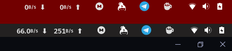
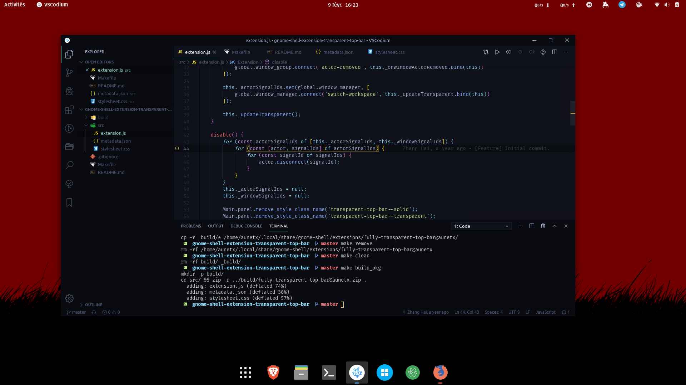
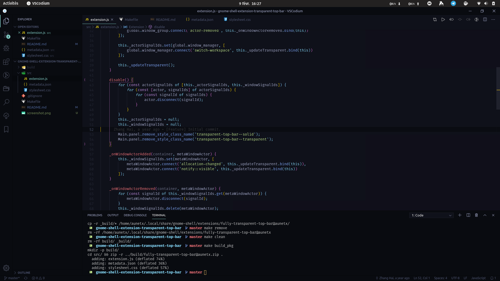

# GNOME Shell Extension - Smart transparent topbar

A GNOME Shell extension that brings back the transparent top bar when free-floating in GNOME Shell.

This extension now supports changing opacity and color of topbar, and will maybe support soon changing at least:

- colors transition duration
- topbar text color
- topbar text shadow

Originally based on zhanghai's [work](https://github.com/zhanghai/gnome-shell-extension-transparent-top-bar); by the way, thanks to him!

## Screenshots

With a non-maximized window:

With a maximized one:

## Versions

Supported GNOME Shell versions:

- 3.32
- 3.34
- 3.36

## License

This program is distributed under the terms of the GNU General Public License, version 2 or later.
